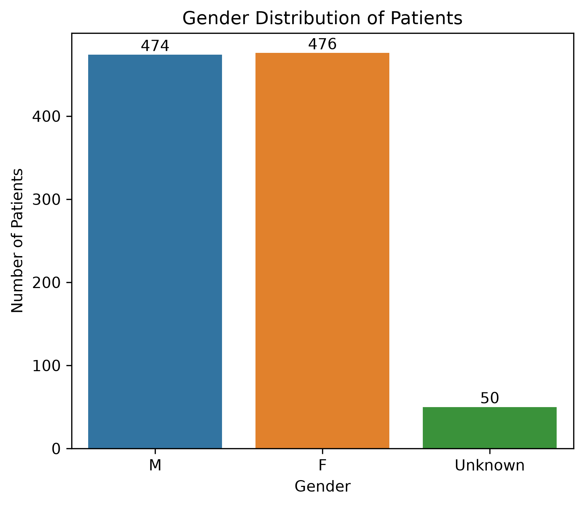
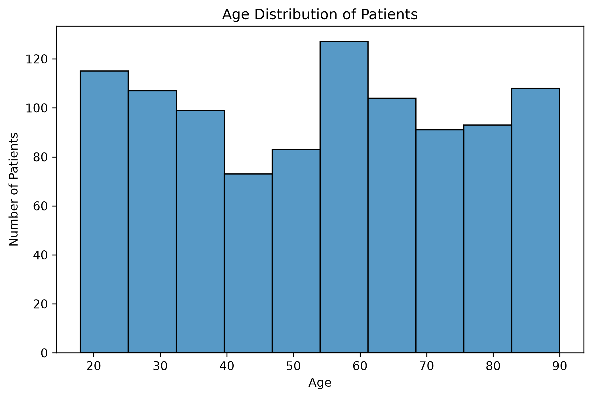
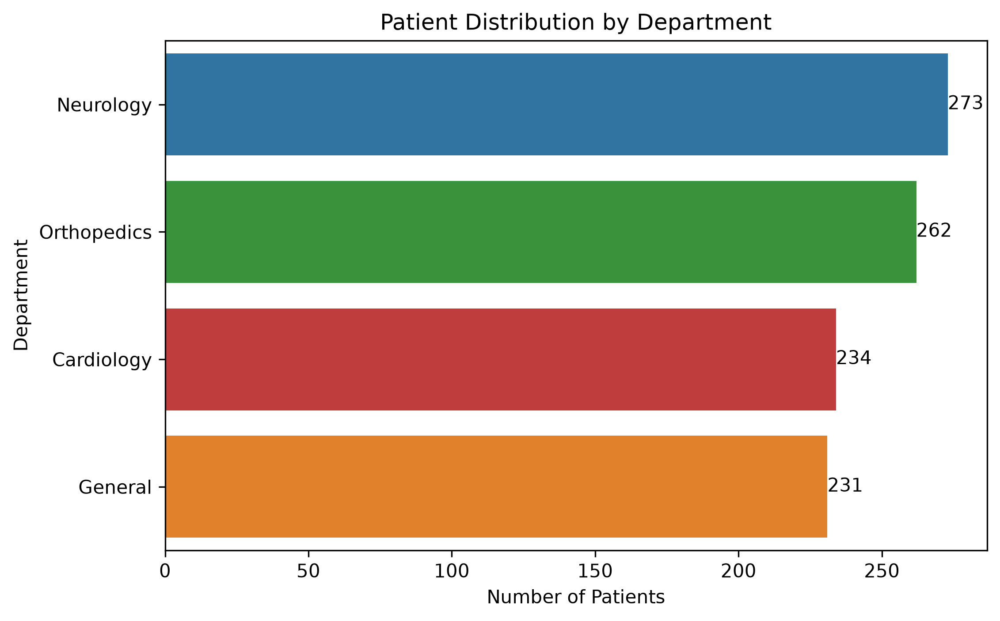
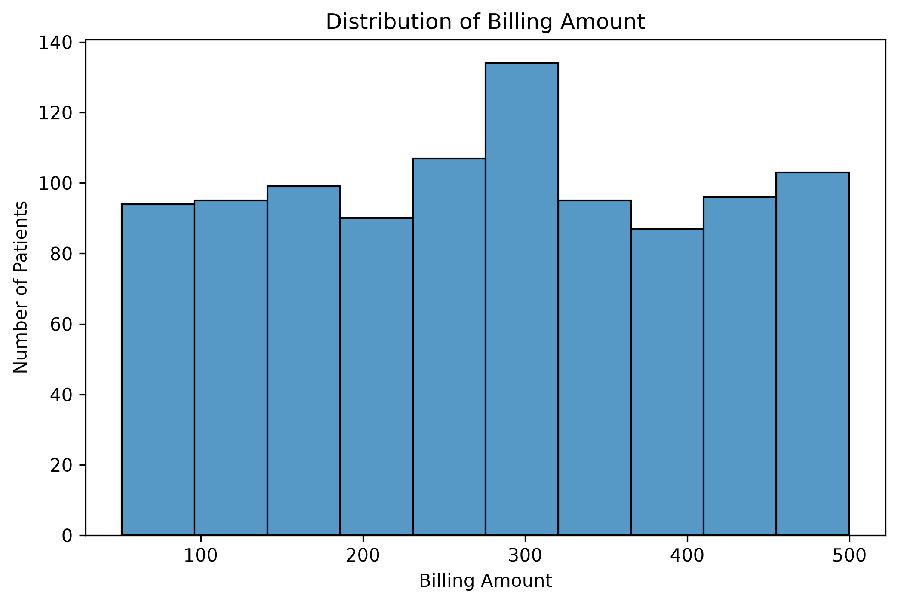
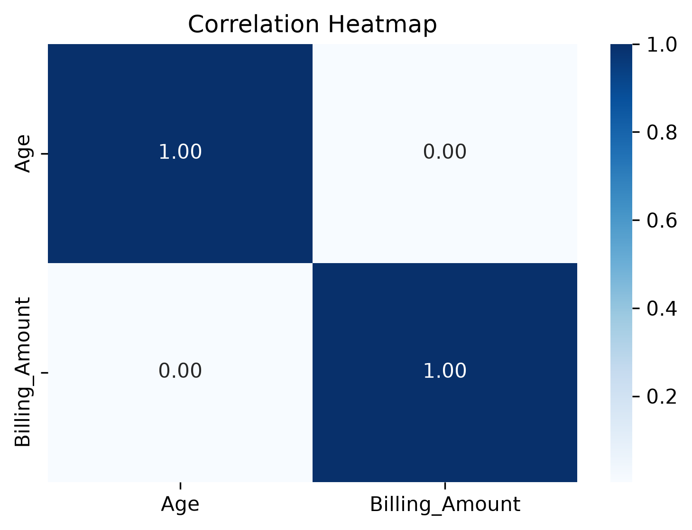

# 🏥 Clinic Appointment Data Cleaning & Exploratory Data Analysis

## 📌 Project Overview

This project demonstrates a complete **Data Cleaning** and **Exploratory Data Analysis (EDA)** workflow using Python.

The original dataset contained:
- Inconsistent formatting
- Missing values
- Inconsistent categorical values
- Mixed date formats
- Billing amounts stored as text with currency symbols

The dataset was cleaned and transformed before performing exploratory data analysis to gain meaningful insights.

---

# 🎯 Objectives

- Clean a real-world messy dataset
- Handle missing values
- Standardize categorical data
- Convert date columns into datetime format
- Clean billing amount values
- Validate the final dataset
- Perform Exploratory Data Analysis (EDA)
- Generate professional visualizations

---

# 📊 Dataset

The dataset contains clinic appointment records including:

- Patient ID
- Patient Name
- Age
- Gender
- Appointment Date
- Booking Date
- Doctor
- Department
- Billing Amount
- Follow-up Required

---

# 🛠 Technologies Used

- Python
- Pandas
- Matplotlib
- Seaborn

---

# 🧹 Data Cleaning Process

The following cleaning steps were performed:

- Renamed columns using standard naming conventions
- Removed extra spaces from text columns
- Standardized Gender values
- Standardized Follow-up values
- Generated new unique Patient IDs
- Converted Appointment Date and Booking Date into datetime format
- Removed currency symbols from Billing Amount
- Converted Billing Amount to numeric datatype
- Filled missing Billing Amount values using the mean
- Filled missing Gender values with **Unknown**
- Performed final validation of missing values and data types
- Exported the cleaned dataset

---

# 📈 Exploratory Data Analysis

The following visualizations were created:

- Age Distribution
- Gender Distribution
- Department Distribution
- Billing Amount Distribution
- Billing Amount Boxplot
- Follow-up Requirement Distribution
- Average Billing Amount by Department
- Age vs Billing Amount
- Appointments by Month
- Appointments by Weekday
- Correlation Heatmap

---

# 🔍 Key Insights

- Gender distribution is almost equally divided between male and female patients.
- Neurology recorded the highest number of patient visits.
- General department had the highest average billing amount.
- No significant relationship was observed between patient age and billing amount.
- Follow-up requirements were almost evenly distributed.
- Billing amounts were spread across a wide range without extreme outliers.

---

# 📂 Folder Structure

```text
Clinic-Appointment-Data-Cleaning/
│
├── Data/
├── Graphs/
├── Clinic_cleaning.py
├── Clinic_eda.py
├── README.md
└── requirements.txt
```

---

# ▶️ How to Run

Clone the repository:

```bash
git clone <repository-url>
```

Install dependencies:

```bash
pip install -r requirements.txt
```

Run the data cleaning script:

```bash
python Clinic_cleaning.py
```

Run the EDA script:

```bash
python Clinic_eda.py
```

---


## 📊 Visualizations

### Gender Distribution



**Key Insights**
- The dataset contains **476 female**, **474 male**, and **50 unknown** patient records.
- Male and female patients are almost equally represented, indicating a well-balanced dataset.
- Only a small number of records have unknown gender values, which were retained after data cleaning.

---

### Age Distribution



**Key Insights**
- Patient ages range from approximately **18 to 90 years**, providing a diverse age distribution.
- The dataset contains patients across all adult age groups rather than being concentrated in a single age range.
- Invalid or unrealistic age values were cleaned before performing the analysis.

---

### Department Distribution



**Key Insights**
- **Neurology** has the highest number of patient appointments (**273**).
- **Orthopedics** follows with **262** appointments, while **General Medicine** (**231**) and **Cardiology** (**234**) have relatively similar patient counts.
- The distribution suggests that patient visits are fairly balanced across departments, with Neurology receiving slightly higher demand.

---

### Billing Amount Distribution



**Key Insights**
- Billing amounts range approximately from **₹50 to ₹500**.
- Charges are spread across the entire billing range, indicating a variety of consultation and treatment costs.
- No extreme concentration is observed in a single billing range, suggesting a diverse distribution of billing amounts.

---

### Correlation Heatmap



**Key Insights**
- The correlation coefficient between **Age** and **Billing Amount** is approximately **0.00**.
- This indicates **no significant linear relationship** between a patient's age and billing amount in the dataset.
- Billing amounts appear to depend on factors other than age, such as department, treatment, or consultation type.

# 👨‍💻 Author

**Priyans Dangwal**